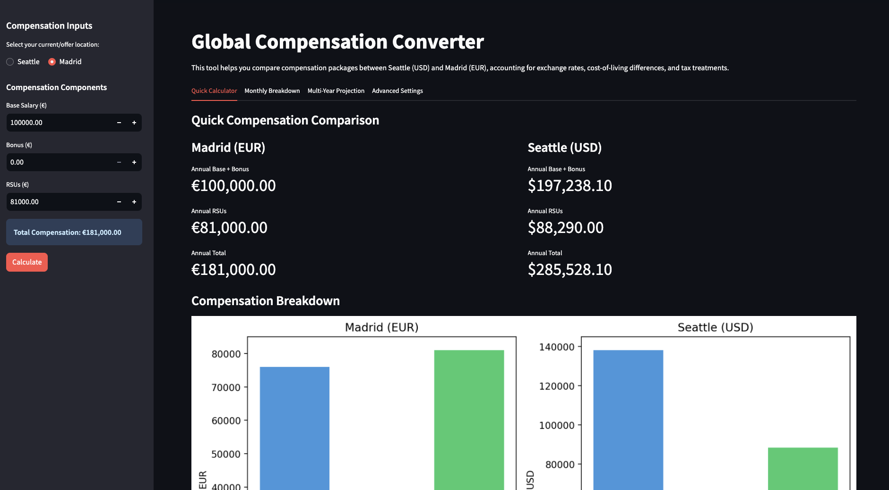
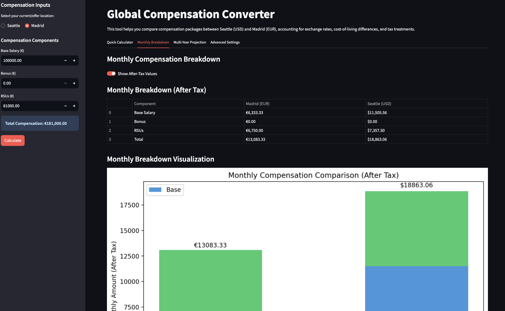
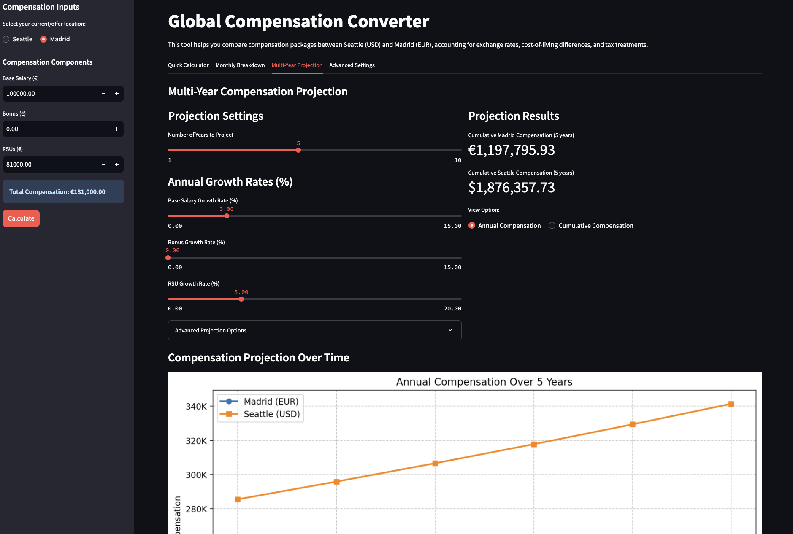
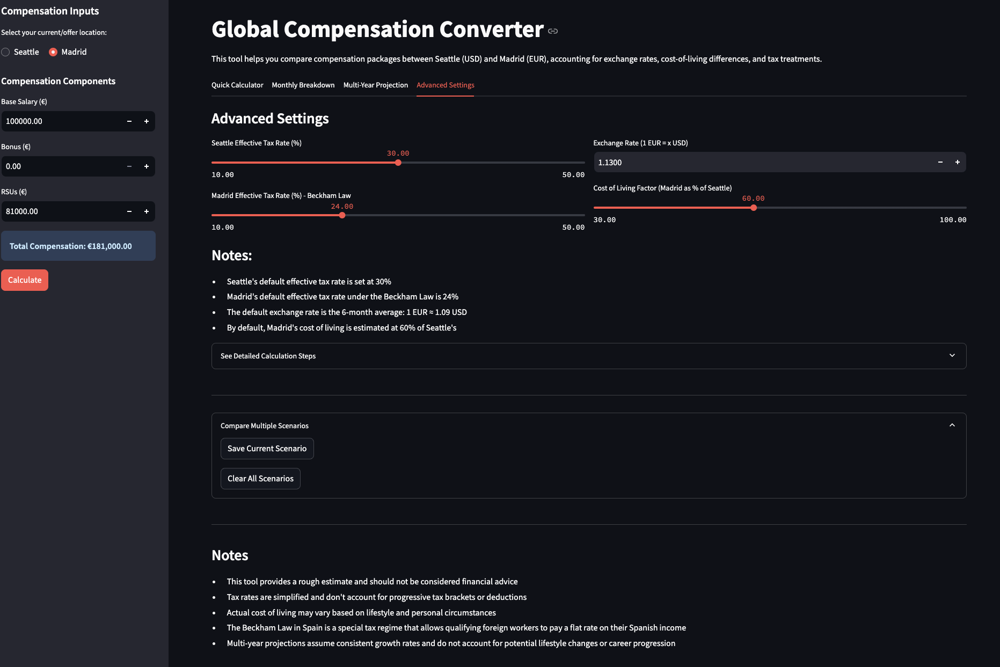

# Global Compensation Converter

A Streamlit application designed to compare compensation packages between Seattle, WA (USD) and Madrid, Spain (EUR). This tool helps individuals evaluate job offers or potential relocations by adjusting for key economic factors like taxes, cost of living, and exchange rates.

## Purpose

Moving between international locations involves navigating complex differences in salary structures, tax implications, and living costs. This tool aims to provide a clearer picture of how a compensation package in one city translates to equivalent purchasing power in the other, specifically comparing Seattle (a major US tech hub) and Madrid (a major European city with specific tax incentives like the Beckham Law).

## Features ✨

* **Bi-directional Conversion:** Calculate equivalent compensation from Seattle to Madrid or Madrid to Seattle.
* **Component Breakdown:** Input Base Salary, Bonus, and RSUs separately.
* **Tax Adjustments:** Incorporates customizable effective tax rates for both locations, with defaults reflecting typical Seattle rates and Madrid's Beckham Law rate.
* **Cost of Living (CoL) Adjustment:** Accounts for the difference in living expenses between the two cities using a configurable CoL factor.
* **Exchange Rate Conversion:** Uses a customizable exchange rate (EUR to USD).
* **Quick Calculator:** Provides an immediate overview of the equivalent annual compensation components (Base+Bonus, RSUs, Total).
* **Monthly Breakdown:** Compares estimated monthly income (before and after tax) side-by-side.
* **Multi-Year Projection:** Forecasts total and cumulative compensation over several years, accounting for customizable annual growth rates for salary, bonus, and RSUs, as well as optional trends for exchange rates and CoL.
* **Visualizations:** Includes charts comparing annual breakdowns, monthly take-home pay, and multi-year projections.
* **Scenario Comparison:** Save different input configurations (scenarios) and compare their outcomes.
* **Detailed Calculation Steps:** Offers transparency by showing the step-by-step conversion logic.
* **Customizable Settings:** Allows users to fine-tune tax rates, CoL factor, exchange rate, and projection parameters via an "Advanced Settings" tab and sidebar inputs.

## How It Works 🧮

The core calculation logic aims to find the target compensation that provides equivalent *purchasing power* after taxes and cost of living adjustments:

1.  **Calculate Net Income (Base + Bonus):** The source base salary and bonus are combined, and the source location's effective tax rate is applied to find the net income.
2.  **Convert Currency:** The source net income is converted to the target currency using the specified exchange rate.
3.  **Adjust for Cost of Living:** The currency-converted net income is adjusted based on the CoL factor (e.g., if Madrid CoL is 60% of Seattle, the net income needed in Madrid is reduced accordingly when converting from Seattle).
4.  **Gross-Up for Target Tax:** The CoL-adjusted net income is "grossed up" using the target location's effective tax rate to find the required gross base + bonus in the target location.
5.  **Convert RSUs:** RSUs are converted directly using the exchange rate (tax implications are simplified in this step but reflected in the overall net calculations where applicable).
6.  **Total Compensation:** The calculated target gross base + bonus is added to the converted RSUs to get the total equivalent compensation.
7.  **Monthly & Projections:** Monthly figures are derived from annual totals, and projections apply growth rates iteratively to the base inputs.

## Screenshots 📸

*(Add screenshots of the application here)*

* **Quick Calculator Tab:**
    
* **Monthly Breakdown Tab:**
    
* **Multi-Year Projection Tab:**
    
* **Advanced Settings & Sidebar:**
    

## Getting Started 🚀

To run this application locally:

1.  **Prerequisites:**
    * Python 3.7+
    * Pip (Python package installer)

2.  **Clone the Repository:**
    ```bash
    git clone https://github.com/mruckman1/Seattle2MadridSalaryComparison
    cd Seattle2MadridSalaryComparison
    ```

3.  **Install Dependencies:**
    ```bash
    pip install -r requirements.txt
    ```

4.  **Run the Streamlit App:**
    ```bash
    streamlit run app.py
    ```
    The application should open automatically in your web browser.

## Configuration ⚙️

Most parameters can be configured directly within the application's UI:

* **Sidebar:** Input your source location, base salary, bonus, and RSUs.
* **Advanced Settings Tab:** Adjust Seattle/Madrid tax rates, EUR/USD exchange rate, and the Cost of Living factor (Madrid as % of Seattle).
* **Multi-Year Projection Tab:** Set the number of years, annual growth rates for compensation components, and optional trend rates for exchange rate and CoL.

## Limitations & Disclaimers ⚠️

* **Estimation Tool:** This tool provides estimates based on simplified models. It is **not** financial or tax advice. Consult with qualified professionals for personalized guidance.
* **Simplified Taxes:** Effective tax rates are used as single percentages. Real-world taxes involve progressive brackets, deductions, credits, and potentially different treatments for various income types (salary vs. bonus vs. RSUs), which are not fully modeled here. The Beckham Law in Spain also has specific eligibility requirements and nuances not covered in detail.
* **Cost of Living:** CoL is highly subjective and varies based on individual lifestyle, family size, neighborhood choices, and spending habits. The CoL factor is a broad estimate.
* **Exchange Rate Volatility:** Exchange rates fluctuate constantly. The tool uses a fixed rate but allows adjustments. Projections assume a steady (or linearly trending) rate.
* **RSU Valuation:** RSU value is based on the input amount and doesn't account for stock price volatility or vesting schedules beyond the annual growth rate input.
* **Projection Assumptions:** Multi-year projections rely on consistent growth rates and trends, which may not reflect actual career progression, market changes, or economic shifts.